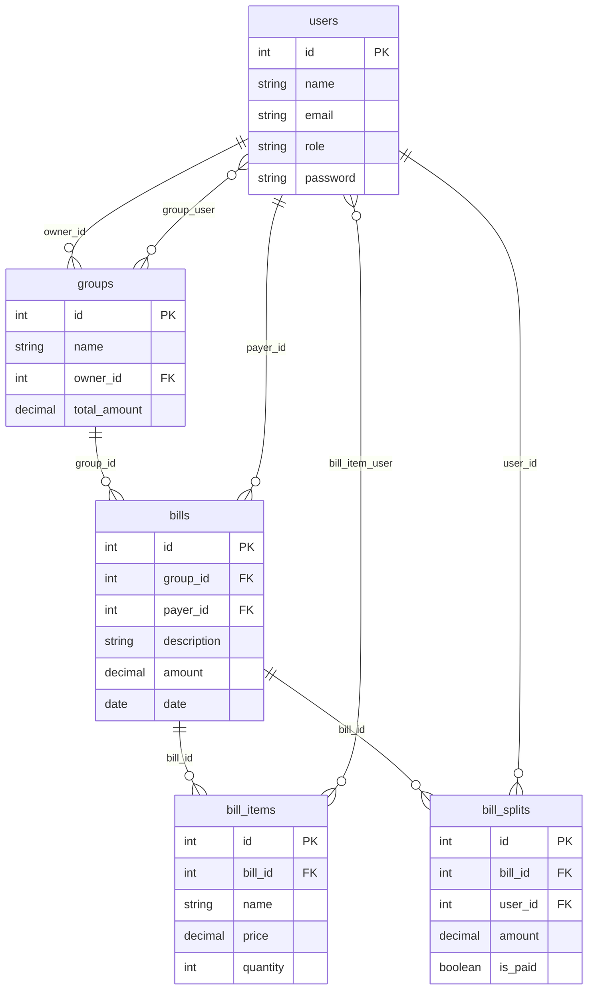

# Dokumentacja Projektu: System do Rozliczania Wspolnych Wydatkow

**Przedmiot:** Aplikacje Internetowe  
**Autorzy:** Krystian Oliwka *(uzupelnij dane)*  
**Kierunek/Rok:** *(uzupelnij)*

---

## 1. Opis projektu

System umozliwia sprawiedliwe rozliczanie wspolnych wydatkow w grupach (np. wycieczki). Zamiast arkusza kalkulacyjnego aplikacja oferuje:

- tworzenie grup rozliczeniowych
- dodawanie rachunkow z wyborem platnika
- automatyczny podzial kosztow (`bill_splits`)
- rozbijanie rachunku na pozycje z paragonu (`bill_items`) z przypisaniem do osob
- bilansowanie naleznosci (kto komu ile jest winien)
- role uzytkownikow (user / admin)
- triggery bazodanowe aktualizujace sume wydatkow grupy

**Technologie:** PHP 8.2, Laravel 12, Blade, Tailwind CSS, SQLite (dev) / MySQL (produkcja + triggery)

---

## 2. Poziomy wymagan

### Ocena 3.0 — CRUD + admin

| Zasob      | Create | Read | Update | Delete |
|------------|--------|------|--------|--------|
| Grupy      | tak    | tak  | tak    | tak    |
| Rachunki   | tak    | tak  | —      | tak    |
| Uzytkownicy (admin) | — | tak | tak (rola) | tak |

Administrator (`role = admin`) zarzadza uzytkownikami w panelu `/admin/users`.

### Ocena 4.0 — Role i uprawnienia

- Kolumna `users.role` — wartosci: `user`, `admin`
- Uzytkownik zarzadza wlasnymi grupami (tworzenie, edycja, usuwanie, dodawanie czlonkow)
- Administrator widzi wszystkie grupy, moze je edytowac/usuwac, zarzadza profilami innych

Middleware: `app/Http/Middleware/AdminMiddleware.php`

### Ocena 5.0 — Logika biznesowa

- **Wielu platnikow** — przy dodawaniu rachunku wybiera sie platnika z czlonkow grupy
- **Podzial kosztow** — tabela `bill_splits`, automatyczny rowny podzial przy dodaniu rachunku
- **Pozycje z paragonu** — `bill_items` + `bill_item_user` (przypisanie pozycji do osob)
- **Bilansowanie** — algorytm: `saldo = zaplacone - naleznosci`; na MySQL: funkcja `get_user_net_balance()`
- **Triggery DB** — automatyczna aktualizacja `groups.total_amount`, walidacja czlonkostwa przy przypisaniu pozycji

---

## 3. Baza danych

### 3.1 Diagram ERD



### 3.2 Opis tabel

| Tabela | Opis |
|--------|------|
| `users` | Konta uzytkownikow z rola (`user`/`admin`) |
| `groups` | Grupy rozliczeniowe; `total_amount` utrzymywane przez trigger |
| `group_user` | Tabela posrednia: czlonkowie grupy (M:N) |
| `bills` | Rachunki/wydatki; kazdy ma jednego platnika |
| `bill_splits` | Ile dana osoba jest winna za dany rachunek |
| `bill_items` | Pozycje z paragonu (np. Pizza, Napoj) |
| `bill_item_user` | Kto odpowiada za dana pozycje |

### 3.3 Kod SQL (MySQL)

Tabele tworza migracje Laravel (`database/migrations/`). Przykladowy fragment:

```sql
CREATE TABLE groups (
    id BIGINT UNSIGNED AUTO_INCREMENT PRIMARY KEY,
    name VARCHAR(255) NOT NULL,
    owner_id BIGINT UNSIGNED NOT NULL,
    total_amount DECIMAL(12,2) DEFAULT 0,
    created_at TIMESTAMP NULL,
    updated_at TIMESTAMP NULL,
    FOREIGN KEY (owner_id) REFERENCES users(id) ON DELETE CASCADE
);

CREATE TABLE bills (
    id BIGINT UNSIGNED AUTO_INCREMENT PRIMARY KEY,
    group_id BIGINT UNSIGNED NOT NULL,
    payer_id BIGINT UNSIGNED NOT NULL,
    description VARCHAR(255) NOT NULL,
    amount DECIMAL(10,2) NOT NULL,
    date DATE NOT NULL,
    FOREIGN KEY (group_id) REFERENCES groups(id) ON DELETE CASCADE,
    FOREIGN KEY (payer_id) REFERENCES users(id) ON DELETE CASCADE
);
```

---

## 4. Triggery i funkcja skladowa (wymaganie techniczne)

Plik: `database/migrations/2026_05_14_163307_add_trigger_and_total_to_groups.php`

### Trigger 1–3: Aktualizacja `total_amount`

Po INSERT/UPDATE/DELETE na `bills` automatycznie przelicza sume wydatkow grupy.

```sql
CREATE TRIGGER update_group_total_after_bill_insert AFTER INSERT ON bills
FOR EACH ROW
BEGIN
    UPDATE groups SET total_amount = total_amount + NEW.amount WHERE id = NEW.group_id;
END;
```

(analogicznie dla UPDATE i DELETE)

### Trigger 4: Walidacja czlonkostwa

Przed przypisaniem pozycji paragonu do uzytkownika sprawdza, czy nalezy do grupy:

```sql
CREATE TRIGGER validate_user_in_group_before_item_assign
BEFORE INSERT ON bill_item_user
FOR EACH ROW
BEGIN
    -- jesli user nie jest w group_user -> SIGNAL SQLSTATE '45000'
END;
```

### Funkcja skladowa: `get_user_net_balance`

```sql
CREATE FUNCTION get_user_net_balance(p_user_id INT, p_group_id INT)
RETURNS DECIMAL(10,2)
BEGIN
    -- zaplacone (bills.payer_id) - naleznosci (bill_splits)
    RETURN v_total_paid - v_total_owed;
END;
```

Uzywana w `Group::getBalances()` na MySQL.

---

## 5. Algorytmy

### 5.1 Rowny podzial rachunku

```
WEJSCIE: rachunek R o kwocie K, grupa G z N czlonkami
WYJSCIE: rekordy bill_splits

Dla kazdego czlonka C:
    udzial = K / N
    utworz bill_split(bill=R, user=C, amount=udzial)
```

Implementacja: `BillController::createEqualSplits()`

### 5.2 Bilans uzytkownika w grupie

```
WEJSCIE: user_id U, group_id G
WYJSCIE: saldo S

zaplacone = SUM(bills.amount WHERE payer_id=U AND group_id=G)
naleznosci = SUM(bill_splits.amount WHERE user_id=U AND bill IN grupa G)
S = zaplacone - naleznosci

S > 0  -> inni mu winni
S < 0  -> on jest winien
S = 0  -> rozliczony
```

Implementacja: `Group::getBalances()` + funkcja SQL `get_user_net_balance()`

---

## 6. Mapa CRUD w aplikacji

| Zasob | Kontroler | Trasy |
|-------|-----------|-------|
| Grupy | `GroupController` | `groups.*` |
| Rachunki | `BillController` | `bills.store`, `bills.destroy` |
| Pozycje paragonu | `BillItemController` | `bill-items.store` |
| Uzytkownicy (admin) | `Admin\UserController` | `admin.users.*` |
| Profil | `ProfileController` | `profile.*` |

---

## 7. Dostep zdalny do bazy danych

### Zalozenia

- Baza MySQL na serwerze (np. hosting studencki / lokalny XAMPP)
- Dostep przez phpMyAdmin, HeidiSQL lub MySQL Workbench
- Aplikacja Laravel laczy sie przez PDO (`config/database.php`)

### Konfiguracja `.env`

```env
DB_CONNECTION=mysql
DB_HOST=adres.serwera.pl
DB_PORT=3306
DB_DATABASE=nazwa_bazy
DB_USERNAME=uzytkownik
DB_PASSWORD=haslo
```

### Zrzuty ekranu do dokumentacji

Przy obronie dolacz screenshoty:
1. phpMyAdmin — lista tabel
2. phpMyAdmin — zawartosc `bills`, `bill_splits`, `groups.total_amount`
3. HeidiSQL — definicja triggera `update_group_total_after_bill_insert`
4. Aplikacja — panel rozliczen z saldami

---

## 8. Struktura repozytorium

```
AplikacjeInternetoweProjekt/
├── Dokumentacja/
│   ├── dokumentacja.pdf      # dokumentacja do oddania
│   ├── dokumentacja.tex      # zrodlo LaTeX
│   ├── DOKUMENTACJA.md       # ten plik
│   ├── JAK_URUCHOMIC.md      # instrukcja uruchomienia
│   └── screenshots/          # zrzuty ekranu
└── ProjektAplikacje/         # aplikacja Laravel
    ├── app/
    ├── database/
    ├── resources/views/
    └── routes/web.php
```

---

*Przed oddaniem uzupelnij strone tytulowa (imie, kierunek, rok) i dolacz zrzuty ekranu z sekcji 7.*
